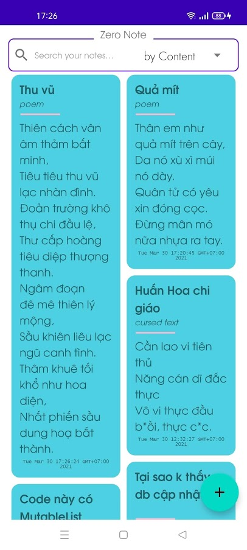
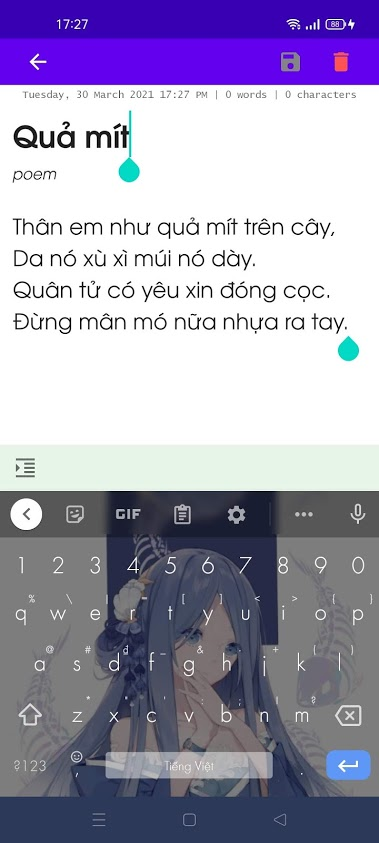

# Báo cáo Giữa kỳ - Ứng dụng Ghi chú

## Tóm tắt

Ứng dụng Android cho phép tạo, chỉnh sửa và lưu các ghi chú

## Kỹ thuật sử dụng

Mã nguồn được tổ chức với kiến trúc MVVM, viết bằng Kotlin. Đồ án sử dụng 3 kỹ thuật chính, bao gồm:

- `Room`: Quản lý, thực hiện các thao tác thêm, xóa, sửa với database
- `Coroutine`: Sử dụng cùng với các thao tác trên database, tránh để UI bị treo khi truy vấn dữ liệu

- `LiveData`: Cập nhật UI tương ứng với dữ liệu khi có sự thay đổi

Kết quả demo: https://youtu.be/i5fUT8MIpts

## Điểm tự đánh giá

- Màn hình danh sách (3.5/4): Hiển thị đầy đủ thông tin, nhìn rõ trên dark/light theme. Chức năng tìm kiếm hoạt động tốt. Vẫn còn không gian để mở rộng thêm khả năng xóa nhiều note cùng lúc thay vì từng cái một
- Màn hình chi tiết ghi chú (3/3): Thực hiện đủ chức năng được yêu cầu
- Lưu trữ (1.5/1.5): Thực hiện đủ chức năng được yêu cầu
- Giao diện (1.5/1.5): Dễ sử dụng. Cập nhật đúng với trạng thái dữ liệu

